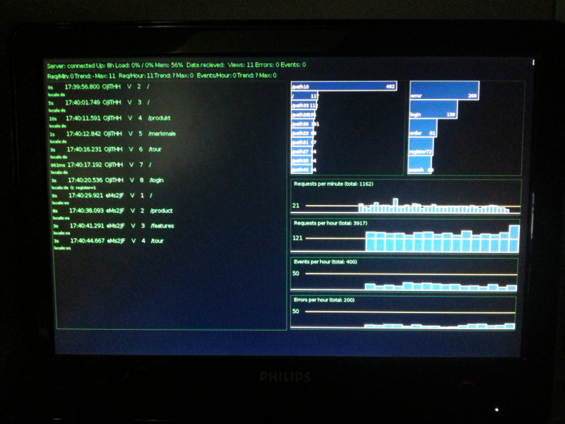

                                         
# Adnoce

Webtracking tool for [Express](https://github.com/visionmedia/express/) and [jQuery](http://jquery.com) based sites with integrated server.
Tracks page impressions and server side events and stores them in [MongoDB](http://www.mongodb.org/) (Mongoose) 

## Build Status

Master: [](https://travis-ci.org/hkonitzer/adnoce)
Dev: [](https://travis-ci.org/hkonitzer/adnoce)

## Features

  * Built on [Moongose](http://mongoosejs.com/) and [Express](https://github.com/visionmedia/express/)
  * Integrates in your Express app via routes
  * Tries to connect serveral sessions for a single user via a persistent sessionId stored clientside in the DOMStorage (localStorage)
  * Define own events with flexible payload anywhere in your app
  * Brings own server to view the tracked events in realtime with [Socket.IO](http://socket.io/)
  * The server component can be run standalone, its based on [EJS](https://github.com/visionmedia/ejs) and [Backbone.js](http://backbonejs.org)
  * All data can be accessed in JSON format via GET requests, including query options
  * Basic map/reduce tasks for visits are included, like vists per hour

## Installation

  `$ npm install adnoce`

  Adnoce needs serveral modules, see dependencies

## Overview

### Setup tracking for page impressions in your app (adnoce-core)

```js
  // setup websockets
  var io = io.listen(server); // assume you have already created an expressed based like: var server = http.createServer(app);
  // get adnoce
  var adnoce = require('adnoce');
  // set socket and socket namespace
  adnoce.setServerSocketIO(io, '/adnoce');
  // sets a database connection (if youre using already mongoose, you can skip this)
  adnoce.setDatabase({ host: DATABASE_HOST, name: DATABASE_NAME });
  // these routes are needed to track pageimpressions
  app.get('/adnoce/1.js', adnoce.clientTrackingScript);
  app.get('/adnoce/s', adnoce.clientTrackingScriptUpdate); 
```

### Setup tracking client side in your html

```html
  <script src="/adnoce/1.js" defer></script>
```

You can define own routes to /1.js and the /s endpoint (instead of /adnoce/...), but you have to change the script element above.

### How it works

The page impression is tracked as soon as the request for /adnoce/1.js hits the server. 
After that, the delivered script in 1.js tries to determin a pervousliy collected session id from the clients DOMStorage and sends it back to adnoce via an AJAX call. The so called persistent session id is stored in an own collection, to connect serveral sessions for a user.
This does not work in private mode (DOMStorage is cleared after the browser exits) or if a user clears his cookies (the persistent session id in the DOMStorage will also be destroyed). Otherwise the user sessions can be connected infinitely.

adnoce offers three collections in your MongoDB:

* adnoce-visits: stores every single page impression (url and timestamp) along with url query parameters
* adnoce-sessions: stores a user session along with user-agent and additional user-definable data fields (as key/value pairs in an array)
* adnoce-events: bascially the same as adnoce-sessions (instead user-agent you give a name), but designed for server side events (like user registration, login)

### Setup server to view tracking logs in realtime (adnoce-server)

Adnoce includes a server component which offers a page to view events in realtime.
The server can be run stand-alone or inside your app (different port of course).

```js
  var adnoce = require('adnoce');
  var adnoceserver = new adnoce.server(options);
```

Available options as object:

* host: The hostname, e.g. localhost
* port: The port, e.g. 8080
* cdnurl: The page uses some external js libs like jQuery, Backbone.js, Underscore.js, Moment.js and d3.js. You can define an url to an external cdn to deliver these libs from there. Otherwise these libs are served from Express.
* adnocehost: The server that runs the adnoce-core component (can be the same as host)
* adnoceport: The port of the adnoce-core component server
* databasehost: You have to define the database connection in stand-alone mode, otherwise skip these database settings
* databaseport: Port to MongoDB (defaults to 27017)
* databasename: The database name
* databaseoptions: additional connections options for Moongose/MongoDB (default is {})
* auth: can be set to true and a basic authentification (Basic HTTP Auth) jumps in
* user: the user name for authenticifation (default is admin)
* password: the user password (default is admin)

Example for a stand-alone server, main app is running on www.example.com:
```js
  var adnoceserver = new adnoce.server({
    host: 'localhost', 
    port: 8080, 
    cdnurl: 'http://cdn.example.com', 
    adnocehost: 'http://www.example.com', 
    adnoceport: 80,
    databasehost: 'www.example.com', 
    databasename: 'adnoce',
    auth: true
  });
```

The server component uses websockets to communicate in near realtime with the adnoce core component. Every time a page impression or event is stored in the database, a message is emitted to the connected clients with the full payload of the record.

### Store additional data along with the page impressions

You can add unlimited key/value pairs to the adnoce-visit collection.
To do this, add a function to your express routes to intercept the requests. The following example checks for a user object in the current session object and gets a counter for page views for this particualar session (or init the counter if not present).  
```js
var storeAdditionalDataIntoAdnoce = function(req, res, next) {
  req.adnoceData = { data: [] };
  if (req.session) {
     if (req.session.user) req.adnoceData.data.push({key: 'user', value: 1});
     if (!req.session.views) req.session.views = 1;
     req.session.view++;
     req.adnoceData.data.push({key: 'views', value: req.session.views});
  }
  next();
}
```
Use this function in your route to 1.js (sligtly modified route definition from the example in setup tracking above):

```js
app.get('/adnoce/1.js', storeAdditionalDataIntoAdnoce, adnoce.clientTrackingScript);
```

### Setup server side events in your app

You can define and track own events to store unlimited key/value pairs along with a name and the session id.
Place the call to adnoce anywhere in your app, but beware, you need the session id at hand. For example:
```js
var adnoce = require('adnoce');
adnoce.addEvent(200, 'user', request.session.id, [{ key: 'action', value: 'register' }, { key: 'reference', value: 'google'}]);
```

The addEvent funtion takes four arguments:
```js
adnoce.addEvent(typeId, eventName, SessionId, keyvalueObjectArray);
```

* typeId: should be 100 (error events) or 200 (other events) in order to work with adnoce-server, but can be set to any number above 1 (1 is reserved for page impressions)
* eventName: a name for your event
* SessionId: this should be the session id from the current request in order to track this event along with page impressions
* keyvalueObjectArray: an array with key/value pairs as object

Consider following example to catch node.js exception's:
```js
process.on('uncaughtException', function (err) {  
  adnoce.addEvent(100, 'error',  'internal', [{ key: 'location', value: 'uncaughtException' }, { key: 'error', value: err }]);
});
```
We dont have an session id here, so we set this to "internal".
See the [Node.js Doc](http://nodejs.org/api/process.html#process_event_uncaughtexception) for more information about "uncaughtException".

You find all events in the adnoce-events collection. These events are also displayed in the adnoce-server view

### Access the data

adnoce-core provides an endpoint for GET requests to retrieve the stored data. You have to specify the collection (adnoce-sessions, adnoce-visits oder adnoce-events) and an optional query object (in this query object you can also give a sort and a limit parameter).
The query object definition follows the [Mongoose ODM docs](http://mongoosejs.com/docs/queries.html).

First, you have to define a route in your app that runs the adnoce-server component:

```js
  app.get('/api/adnocedb/:collection', adnoceserver.routes.genericDBAPI);
```

Now, you can get your data. The following example (with jQuery and Moment.js) returns all visits for the actual day (since 00:00) and sorts it by timestamp:

```js
  $.getJSON('/api/adnocedb/AdnoceVisit', {'timestamp' : {'$gte' : moment().startOf('day').utc().valueOf() }, 'sort' : {'timestamp' : 1}}).success(function(data){
    console.log(data);
  });
```

Note: If no limit is defined (in query object parameter), only the first 5.000 entires are returned.

### Map/Reduce (adnoce-core)

Some basic Map/Reduce tasks are included with adnoce.
* Visits total
* Visits total per hour
* Visits total per month
* User-Agents total

To start a map/reduce task use the following command with the example below. This example sets an interval to run the task every 45min and writes a log after execution:

```js
var adnoce = require('adnoce');
setInterval(adnoce.MapReduce.visitsTotalByHour, 2700000, function(e,d,t) { log.info('RUN mapReduceCronJobs visitsTotalByHour - timeneeded: %sms, error: %s', t, e); });
```

The output collection names start with "adnoce-mr-", e.g. "adnoce-mr-visitstotalbyhour".

You can access the data if you add the following route (you need adnoce-server component running along with adnoce-core in your app):
```js
app.get('/api/adnoce/:collection', adnoceserver.routes.genericMRAPI);
```

Example with jQuery:
```js
  $.getJSON('/api/adnoce/adnoce-mr-visitstotal', {limit: 1000}, function(data) {
    console.log(data);
  });
```

## Please note

There is no authentication method yet to connect the adnoce-server component with adnoce-core in a secure manner.
It is possible to connect to every running adnoce-core component if you know its url and port. Watch the logs to see adnoce-servers connecting with adnoce-core.

## Dependencies

* [Connect](https://github.com/senchalabs/connect) 2.x
* [Express](https://github.com/visionmedia/express) 3.x
* [EJS](git://github.com/visionmedia/ejs.git) 0.x
* [Socket.io](http://socket.io) 0.9.x
* [Socket.io-Client](https://github.com/LearnBoost/socket.io-client.git) 0.x
* [MongoDB](http://mongodb.github.com/node-mongodb-native/) 1.x
* [Mongoose](https://github.com/learnboost/mongoose/) 3.x
* [Log](https://github.com/visionmedia/log.js/) 1.x"

## Example screenshot for adnoce-server


Adnoce-Server in Midori Browser running on an Raspberry Pi

## License

[MIT License](http://www.opensource.org/licenses/mit-license.php)

## Author

Copyright (c) 2013, [Hendrik Konitzer] (hkonitzer@gmail.com)
